# TaskFlow — Portfolio Showcase

A full-featured Flutter task manager app built from scratch, covering the complete user journey from onboarding to task management. Every screen is fully navigable with 14 routes, a custom dark mode system, Riverpod state management, and Hive local persistence.

**GitHub:** https://github.com/TerraRome/TaskManager  
**Stack:** Flutter 3.44.9 · Dart 3.12 · Riverpod · Hive · SharedPreferences  
**Platform:** Android & iOS

---

## Screenshots

---

### Onboarding

| Splash | Onboarding 1 | Onboarding 2 | Onboarding 3 |
|--------|-------------|-------------|-------------|
| 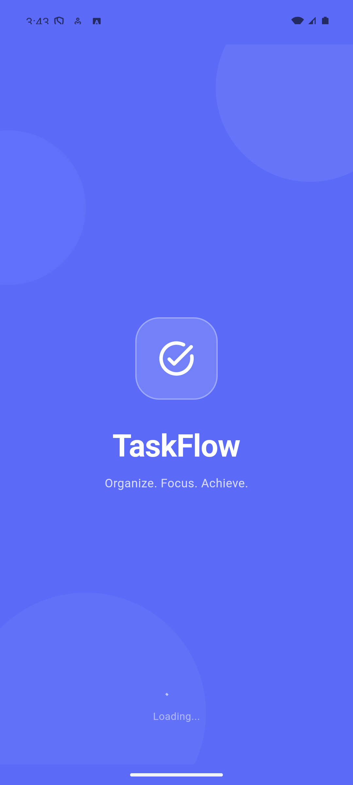 |  |  |  |

### Core

| Home | Schedule | New Task | Task Detail |
|------|----------|---------|------------|
| 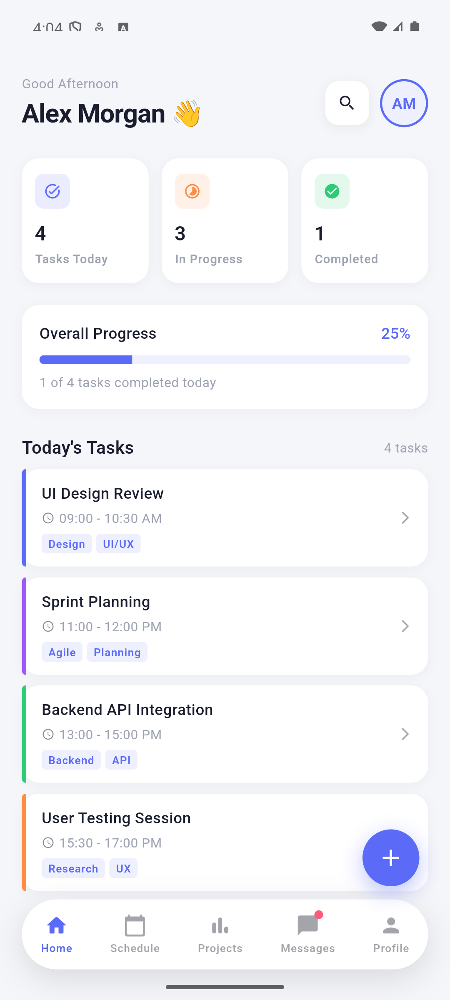 | 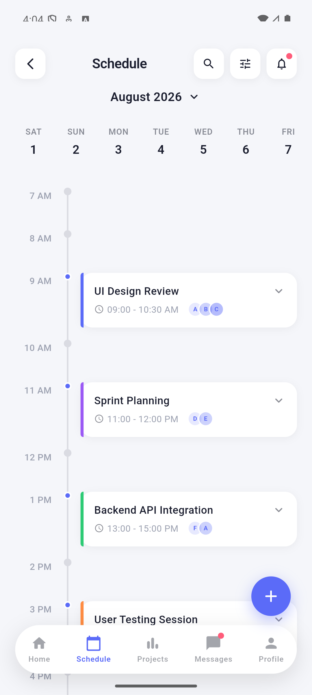 | 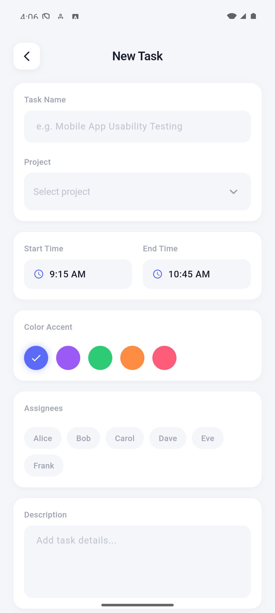 | 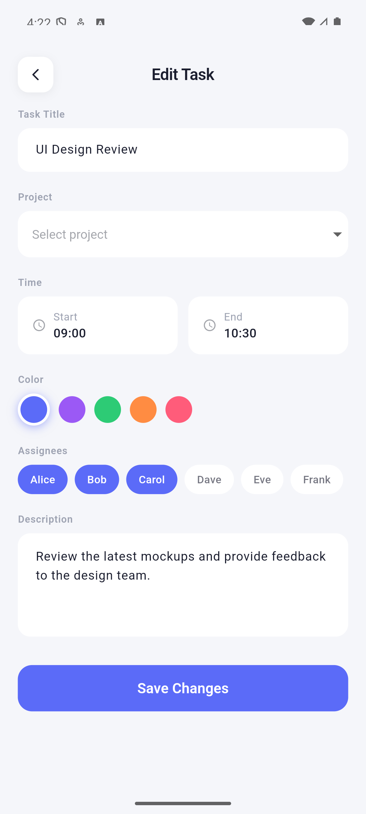 |

| Edit Task | Projects | Project Detail | Search |
|-----------|---------|---------------|--------|
| 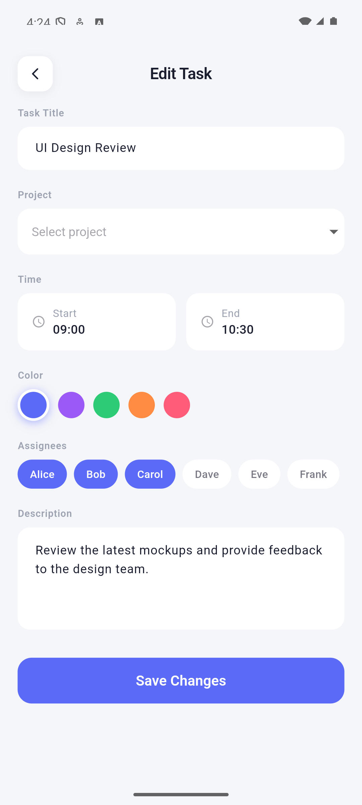 | 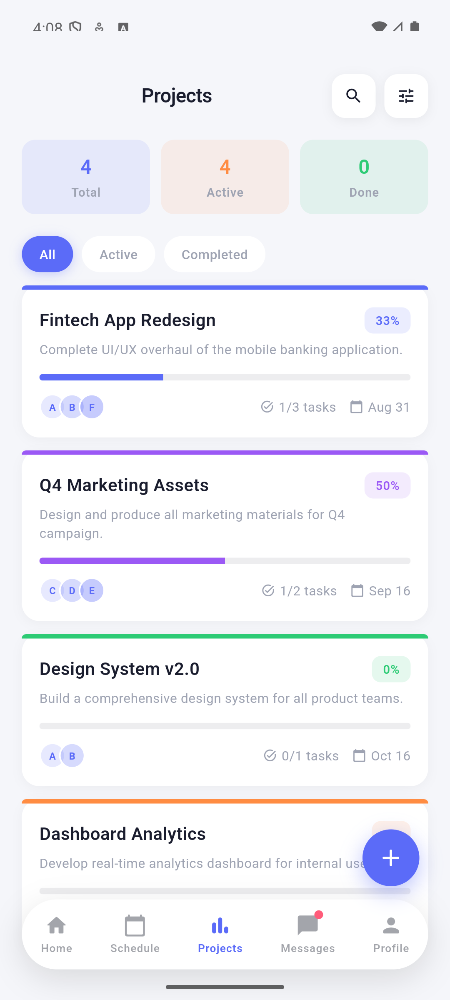 | 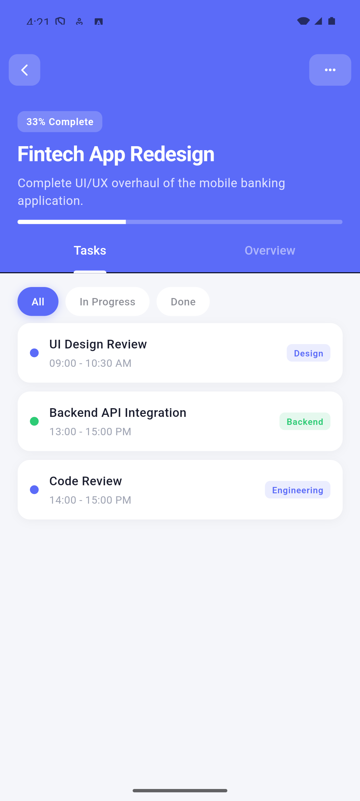 | 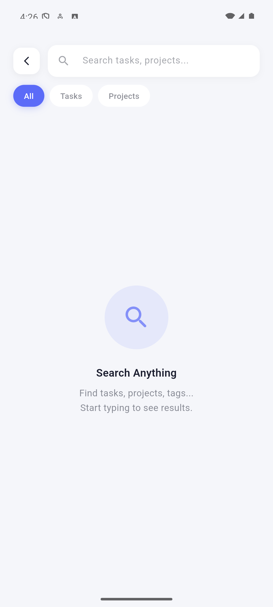 |

### Analytics & Account

| Statistics | Messages | Profile | Settings |
|-----------|---------|---------|---------|
| 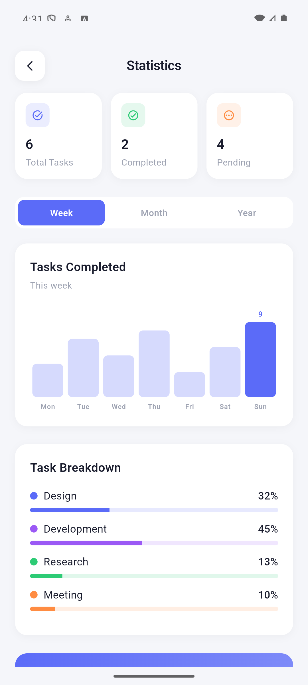 | 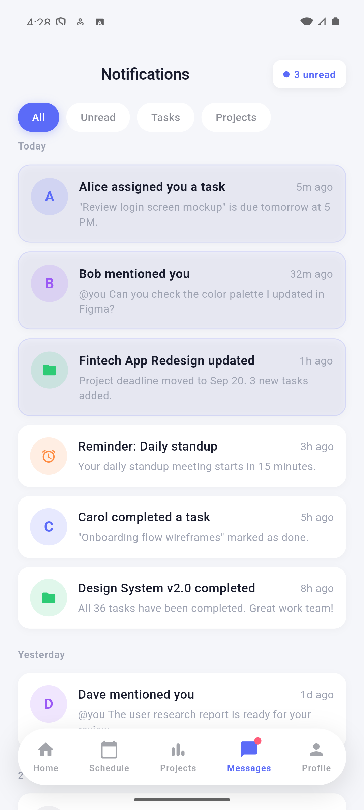 | 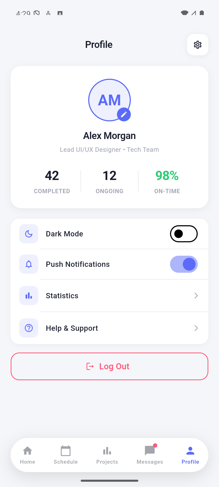 | 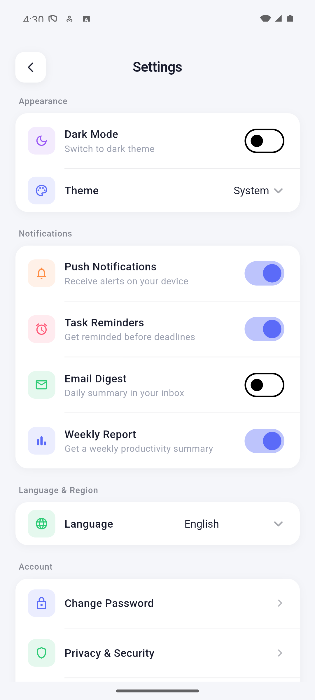 |

### Dark Mode

| Home Dark | Schedule Dark | Projects Dark | Profile Dark |
|-----------|-------------|--------------|-------------|
| 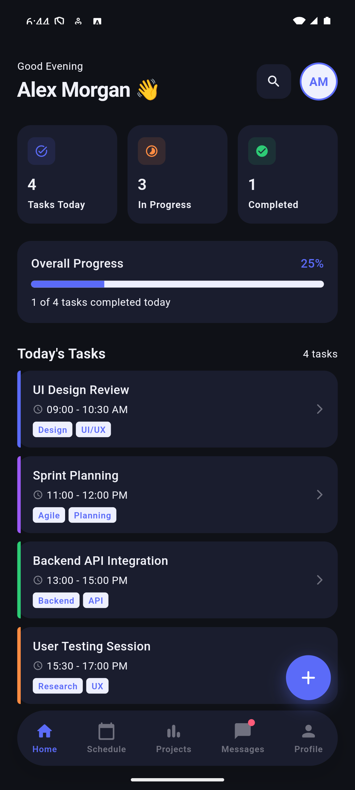 | 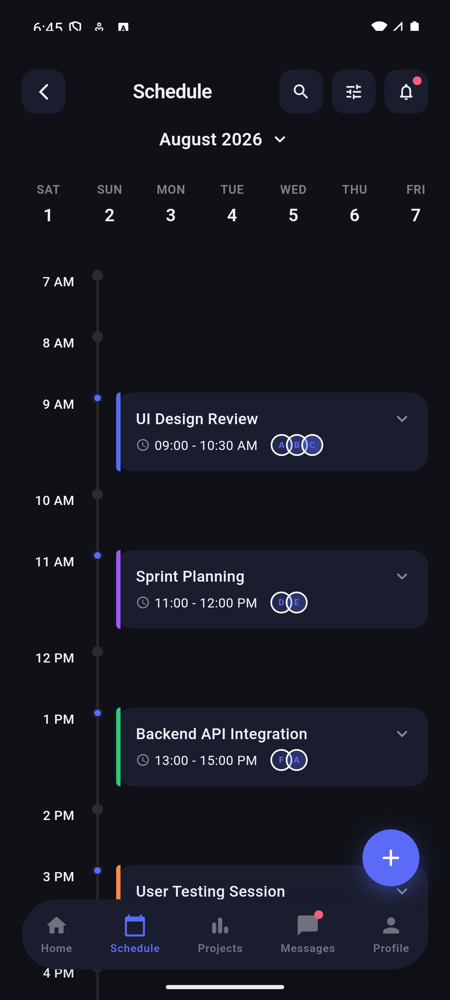 | 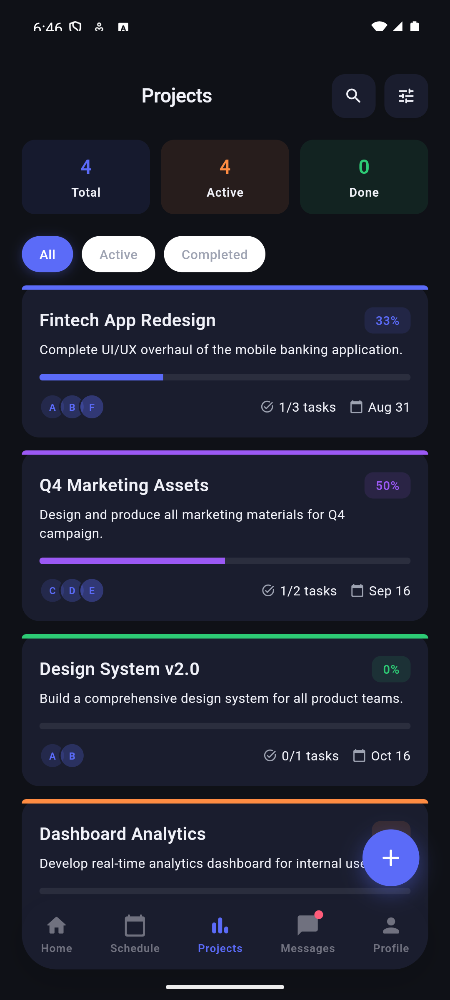 | 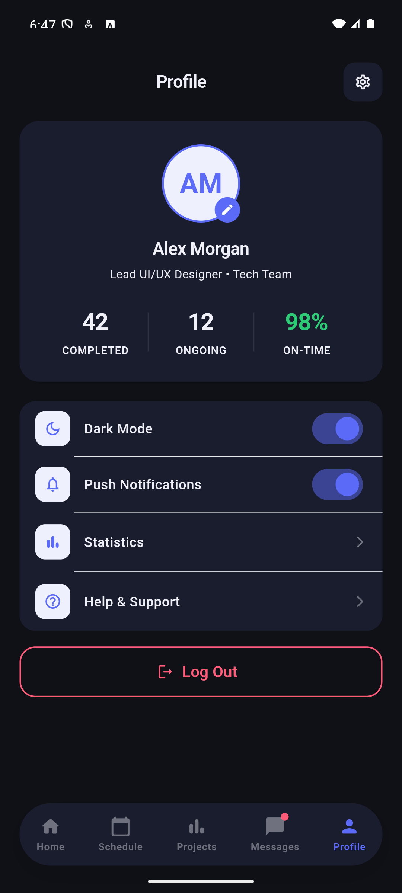 |

| Messages Dark |
|--------------|
| 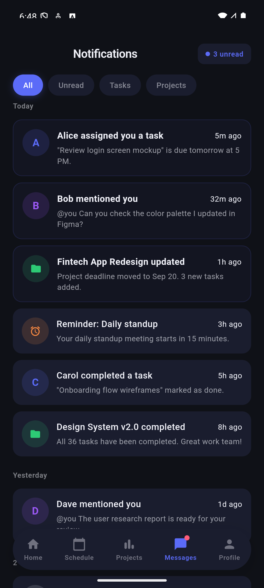 |

---

### GIF Flows

| Onboarding Flow | New Task Flow |
|----------------|--------------|
| 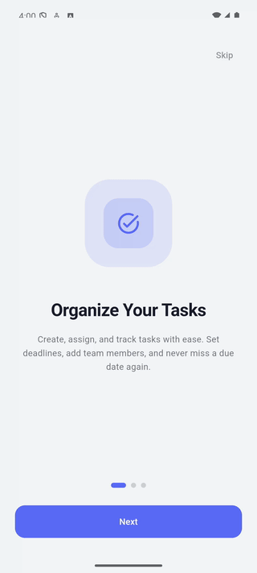 | 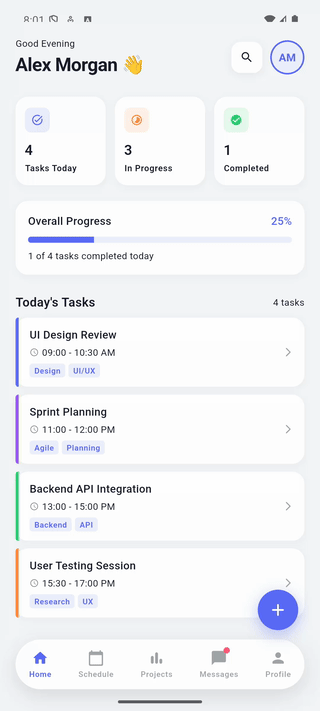 |

---

## What This Project Demonstrates

| Area | Details |
|------|---------|
| UI/UX Engineering | 14 fully navigable screens, consistent design system, pixel-level polish |
| State Management | Riverpod `StateNotifierProvider` + derived `Provider`, scoped to feature |
| Local Persistence | Hive with manual `TypeAdapter`, seed data, full CRUD persistence |
| Dark Mode | Custom `ThemeProvider` (`InheritedWidget`), full `ColorScheme` light + dark |
| Animations | Scale + fade splash, per-slide onboarding, `AnimatedContainer` throughout |
| Form Handling | Time pickers, color selectors, priority picker, assignee chips, validation |
| Design System | Custom tokens (`AppColors`, `AppTextStyles`), no inline styling |
| Code Architecture | Feature-first folder structure, clean separation of concerns |

---

## App Flow Overview

```
Splash → Onboarding (3 slides, first launch only) → Home
    │                                                  │
    └─→ (returning user skips onboarding)              ├─→ Schedule
                                                        │     └─→ Task Detail → Edit Task
                                                        ├─→ New Task
                                                        ├─→ Projects
                                                        │     └─→ Project Detail
                                                        ├─→ Messages (Notifications)
                                                        └─→ Profile
                                                              ├─→ Settings (Dark Mode)
                                                              └─→ Search
                                                                    └─→ Statistics
```

---

## Screens by Feature

### Onboarding

**Splash Screen**
- Scale + fade + slide animation via `AnimationController` (1.4s)
- Decorative background circles with `withValues(alpha:)`
- Smart navigation: checks `onboarding_done` in `SharedPreferences`
- First launch → `/onboarding`, returning user → `/`

**Onboarding** (3 slides)
- `PageView` with per-slide `AnimationController` — slide-in + fade on each transition
- Animated dot indicators with `AnimatedContainer` width expansion
- Skip button (hidden on last slide) + Next / Get Started CTA
- Saves `onboarding_done` flag via `SharedPreferences` on exit

---

### Core

**Home**
- Greeting with current day and date
- Live summary cards: Total / Completed / Pending from `taskProvider`
- Today's task list filtered by `startTime` weekday
- Task cards with color indicator, time range, member avatars, done toggle
- FAB → `NewTaskPage`
- 5-tab bottom navigation

**Schedule**
- Horizontal day selector (Mon–Sun) with animated active pill
- Task list re-filtered on day change
- Mark task done toggle — persisted to Hive via `taskProvider.notifier`
- Tap task card → `TaskDetailPage`

**New Task**
- Full form: title, project selector, start/end time pickers, priority chips, color palette, assignee chips, description
- `GlobalKey<FormState>` validation
- Calls `taskProvider.notifier.addTask()` → Hive persist → navigate back

**Task Detail**
- Full task info: time range, project badge, priority, member chips, tags, description
- Mark as done toggle (live update via Riverpod)
- Edit button → `EditTaskPage`
- More (⋯) bottom sheet: share, delete with confirm

**Edit Task**
- Pre-filled from existing `TaskItem` via route args
- Same form as New Task with `initialValue` on all fields
- Calls `taskProvider.notifier.updateTask()` on save
- Full dark mode support across all input widgets

**Projects**
- 2-column grid of project cards with color header, progress bar, member avatars
- Live data from `projectsWithTaskCountProvider` (derived Riverpod provider)
- Summary row: total projects, total tasks, overall completion %
- Tap card → `ProjectDetailPage`

**Project Detail**
- `NestedScrollView` with `SliverAppBar` expanding to project color
- Tasks tab: filter All / In Progress / Done via `isDone`
- Overview tab: description, deadline, member list
- More (⋯) modal: Edit / Share / Delete

**Search**
- Real-time search across tasks and projects simultaneously
- Sectioned results: Tasks section + Projects section
- Task results show color indicator + time range
- Project results show progress chip + member count
- Empty state illustration

---

### Analytics & Account

**Statistics**
- Summary cards: Total / Completed / Pending — live from `taskProvider`
- Bar chart: Week / Month / Year period selector with `AnimatedContainer` bars
- Task breakdown: Done vs Pending percentage with progress bars
- Productivity Score: calculated from real `doneTasks / totalTasks`
- Top Projects: live from `projectsWithTaskCountProvider`, sorted by `completedTasks`

**Messages (Notifications)**
- Filter tabs: All / Unread / Tasks / Projects — all functional
- Mark all as read (unread badge with count)
- Notifications grouped by Today / Yesterday / N days ago
- Notification types: task assignment, mention, project update, reminder
- Swipe tile → mark individual as read

**Profile**
- Editable name & role via bottom sheet modal (tap avatar)
- Auto-generated initials from name (max 2 chars)
- Stats row: Completed / Ongoing / On-Time
- Settings card with notification toggle and account links
- Logout with `AlertDialog` confirmation → back to `/splash`

**Settings**
- Theme dropdown: System / Light / Dark — connected to `ThemeProvider.setDark()`
- Language, notification, privacy, and account option rows
- About section with app version

---

## Design System

Custom-built design system: **TaskFlow**

```
Primary        #6C63FF  — Indigo Purple
PrimaryLight   #EEF0FF  — Soft Lavender
Background     #F5F6FA  — Cool Off-White  (light)
               #12131A  — Deep Navy       (dark)
Surface        #FFFFFF  — Pure White      (light)
               #1E1F2A  — Dark Card       (dark)
taskBlue       #4A9EFF
taskGreen      #4CAF82
taskOrange     #FF8C42
taskRed        #FF5C6A
taskPurple     #9C6FDE
Font           Inter — Regular / Medium / SemiBold / Bold
```

Applied consistently across all 14 screens:
- All screens use `Theme.of(context).colorScheme.*` — zero hardcoded background/surface/text colors
- `AppColors.primary` and task colors used directly for accent only
- Dark mode toggles instantly via `ThemeProvider` without app restart

---

## Technical Highlights

**ThemeProvider (InheritedWidget)**  
Custom `ThemeProvider` built with `InheritedWidget` — no external theming library. Wraps the entire app and exposes `setDark(bool)` for instant theme switching from any widget via `ThemeProvider.of(context)`.

**Hive + Manual TypeAdapters**  
No code generation — `TaskItemAdapter` (typeId 0) and `ProjectItemAdapter` (typeId 1) are written by hand. `Color` stored as ARGB32 int, `DateTime` as `millisecondsSinceEpoch`. `LocalStorageService` is a static wrapper initialized once in `main()`.

**Riverpod Derived Provider**  
`projectsWithTaskCountProvider` is a derived `Provider<List<ProjectItem>>` that watches both `taskProvider` and `projectProvider` to compute live task counts per project — single source of truth across Projects, Project Detail, and Statistics.

**Smart Onboarding Navigation**  
`SplashPage` checks `SharedPreferences` for `onboarding_done` flag after the animation completes — first-launch users see onboarding, returning users go straight to Home. Flag written on Skip or Get Started.

**Feature-First Architecture**
```
features/
  splash/
  onboarding/
  home/
  schedule/
  new_task/
  task_detail/
  edit_task/
  projects/
  project_detail/
  search/
  statistics/
  messages/
  profile/
  settings/
```
Each feature is self-contained with its own `domain/models/`, `presentation/pages/`, and `presentation/widgets/` — ready to plug in a remote data layer.

---

## Project Stats

| Metric | Count |
|--------|-------|
| Total screens | 14 |
| Dart files | 39 |
| Lines of code | ~8,350 |
| Routes | 14 |
| Design tokens | 15+ |
| Feature modules | 14 |
| Hive TypeAdapters | 2 |
| Riverpod providers | 3 |

---

## Running Locally

```bash
git clone https://github.com/TerraRome/TaskManager.git
cd TaskManager
flutter pub get
flutter run --no-enable-impeller   # Android emulator
flutter run                        # iOS simulator
```

Requires Flutter 3.44.9+. Uses FVM — run `fvm flutter run` if FVM is installed.

---

## Capture Screenshots & GIFs

```bash
# Screenshot all screens (pauses for manual navigation)
bash scripts/capture.sh screenshots

# Record a specific flow as GIF
bash scripts/capture.sh gif onboarding_flow
bash scripts/capture.sh gif dark_mode_flow

# Record all flows
bash scripts/capture.sh gif all
```

Requires Android emulator running (`adb devices`) and `ffmpeg` (`brew install ffmpeg`).  
Output: `docs/screenshots/*.png` · `docs/gifs/*.gif`

---

## Related Docs

- [README.md](./README.md) — Technical documentation, phase roadmap, project structure
